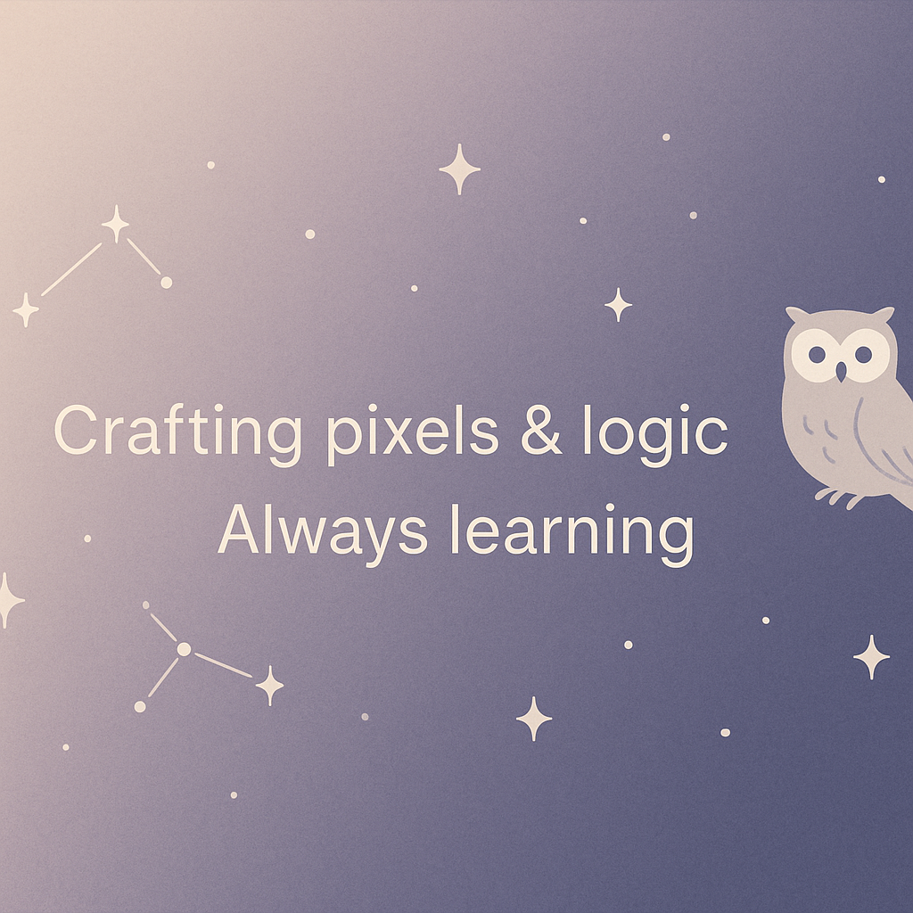

# 🐾 Priya

> quietly crafting. always curious. sometimes caffeinated.

### 🌱 About me  
- Full-time Front End Development student  
- Exploring JavaScript, Python, Raspberry Pi & trading logic  
- Testing things, breaking things, fixing them softly 🌿  
- Open for curious minds & fun projects  

### 🛠️ Tech Playground  
- JavaScript (Vanilla, DOM, Axios, Jest)  
- Node.js • Python (learning) • Raspberry Pi (exploring)  
- Love for clean code, simple things & small wins ✨  

### 🧩 How to reach me  
If your project is kind, creative, or curious —  
> drop a message via  
> [GitHub](https://github.com/priyaspalaniappan)  
> or  
> [LinkedIn](https://www.linkedin.com/in/priya-palaniappan-590b842b3/) 🕊️  

---

_“I like people who get excited about the stars and code at the same time.”_

